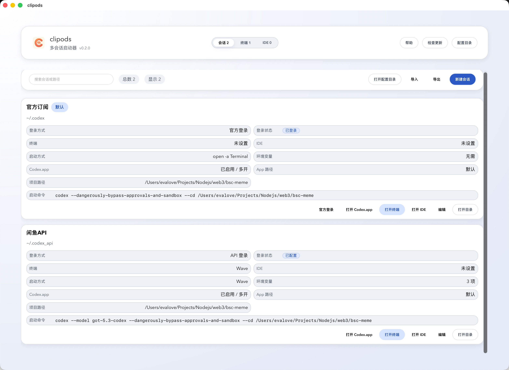
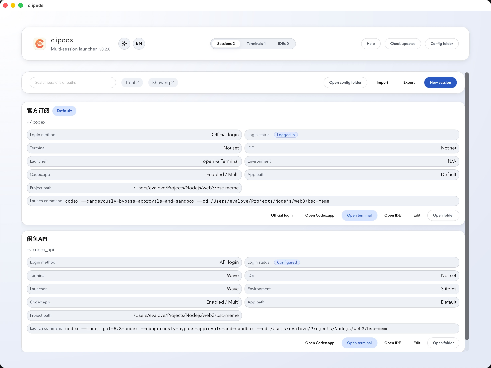
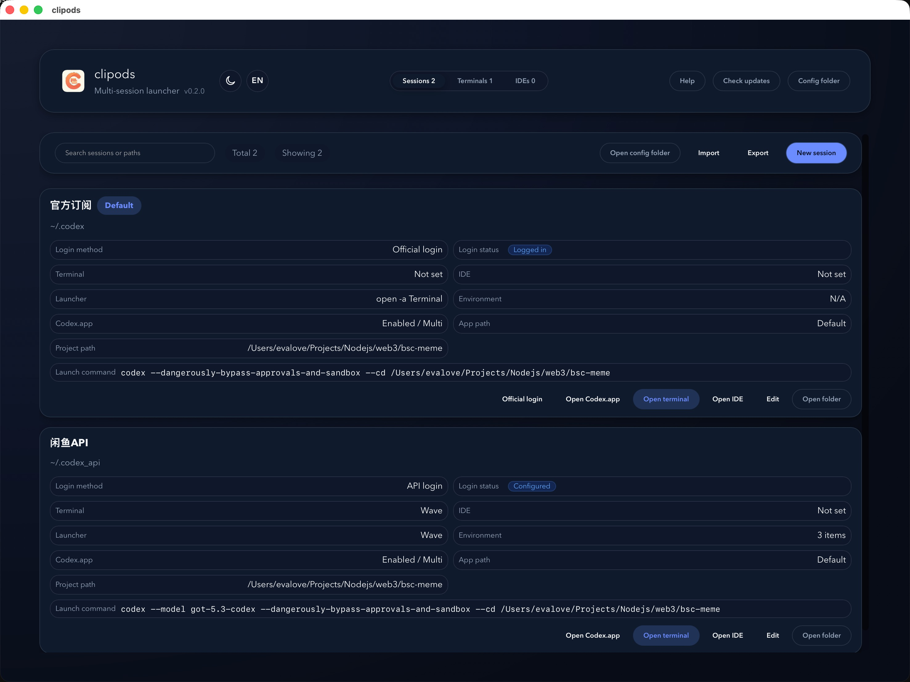
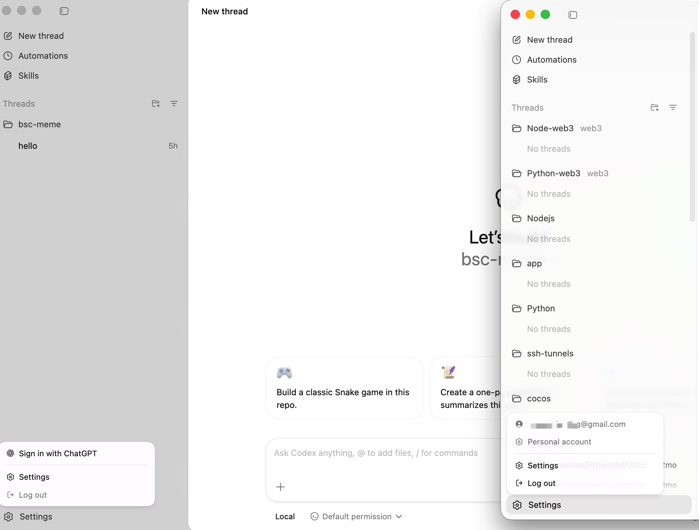

# clipods

clipods: a multi-session launcher for Codex CLI (Tauri + React). Default UI language is Chinese; use the ZH/EN toggle near the logo to switch.

[中文](README.md)
[Changelog](CHANGELOG.md)

## Core features

- Multi-account sessions: each session has its own `CODEX_HOME` and login type (Official/API).
- Terminal & IDE profiles: define launch command and arguments per tool.
- Import/Export: TOML config import/export for backup and sync.
- One-click launch: open terminal/IDE and jump to the session directory.
- Theme/Language: dark mode toggle and ZH/EN switch.
- Codex.app: supports multi-instance and per-session isolation (separate userDataDir).
- Runtime self-heal: before launch, missing `AGENTS.md` and `.codex-global-state.json` are created in session homes.

## 0.2.3 highlights

- Fixed Ghostty terminal execution for composite commands via shell wrapping.
- Added compatibility for legacy Ghostty args (`-e {command}`) with shell fallback.
- Unified version to `0.2.3` across `package.json`, `Cargo.toml`, and `tauri.conf.json`.

## 0.2.2 highlights

- Added runtime defaults self-heal for `AGENTS.md` and `.codex-global-state.json`.
- Strengthened Codex.app multi-instance isolation path (`CODEX_HOME` + `userDataDir`).
- Unified version to `0.2.2` across `package.json`, `Cargo.toml`, and `tauri.conf.json`.

## Codex.app multi-instance troubleshooting

If one instance shows realtime progress details and another does not:

1. Ensure each session uses its own `CODEX_HOME` (avoid reusing polluted legacy dirs).
2. Use a dedicated `userDataDir` per Codex.app instance.
3. Verify required files under each session home:
   - `AGENTS.md`
   - `.codex-global-state.json`
   - `config.toml`
   - `auth.json` for API-login sessions
4. Confirm launch arguments include `--user-data-dir <path>`.
5. If only legacy instances fail, bind the session to a clean `CODEX_HOME` and retry.

Quick checks:

```bash
ls -la <CODEX_HOME>
cat <CODEX_HOME>/.codex-global-state.json
```

## How to use

1. Create a session: set name, `CODEX_HOME`, and login type.
2. Terminal profile: enter app name or `.app` path (Terminal, iTerm2, `/Applications/Warp.app`); drag & drop supported.
3. IDE profile: enter app name or `.app` path (VS Code, Cursor, `/Applications/Cursor.app`).
4. Bind profiles: pick terminal/IDE for the session, then save.
5. Import/Export: use the toolbar to import/export TOML.
6. Session launch command: set `codex ...` command to run automatically on terminal launch.
7. Codex.app: optionally enable multi-instance and session isolation for parallel logins.
8. Help: the top-right “Help” shows first-run and update notes.

## Command & arguments

- Launch command uses macOS `open -a`, supports app name or `.app` path.
  - Examples: `Terminal`, `iTerm2`, `Wave`, `/Applications/Warp.app`
- Launch args: one per line, equivalent to `open -a App --args arg1 arg2`.
  - Example: `--reuse-window`
  - Placeholders: `{command}` for session launch command, `{cwd}` for session directory
- Wave: when selected and no args are set, it runs commands via `wsh run`.
- Ghostty: session command is shell-wrapped by default for composite command compatibility.
- Terminal templates: built-in Terminal / iTerm2 / Wave / Ghostty presets.
- Environment variables: only terminal profiles support env vars, format `KEY=VALUE`.

## Session command notes

- The “launch command” runs when opening terminal and injects:
  - `CODEX_HOME` (session directory)
  - Session environment variables
- Builder supports interactive / resume / exec / exec & resume with in-UI hints.

## Dev & run

```bash
npm install
npm run dev
npm run tauri dev
```

> `npm run tauri dev` requires Rust toolchain via rustup.

## macOS first launch (unsigned app)

- If you see “developer cannot be verified”, open “System Settings → Privacy & Security” and click “Open Anyway”.
- Or right-click the app in Finder → Open.

## Config

- Config is stored under Tauri `appConfigDir()`.
- Sessions, terminals, IDEs are stored in TOML.
- Saving a session or opening terminal writes Codex config to `CODEX_HOME/config.toml`.
- API sessions write `CODEX_HOME/auth.json` with `OPENAI_API_KEY`.

## Security notes (API key)

- `auth.json` is local session runtime data and must not be committed or shared.
- Restrict session directory permissions to the current user on shared machines.
- Rotate `OPENAI_API_KEY` immediately if leakage is suspected.

## Local build & install (macOS)

```bash
npm run install:macos
```

If you see permission errors, run with `sudo`.

## Release signing and updater

- `npm run install:macos` is an unsigned local install flow for local validation.
- GitHub Release builds are signed via workflow secrets:
  - `TAURI_SIGNING_PRIVATE_KEY`
  - `TAURI_SIGNING_PRIVATE_KEY_PASSWORD`
- Auto-updates require matching `latest.json`, `updater.endpoints`, and `updater.pubkey`.

## Screenshots






## Documentation Rules

- Any structural change (new/removed/moved files or folders) must update the relevant `_README.md` in each affected directory.
- Any change to functionality, architecture, or coding conventions must update the related sub-docs in the same change set.
